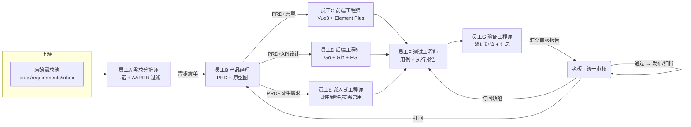

# AI 起爆一体化工具集 · 多AI员工研发流水线 落地文档

> 版本：v1.0 ｜ 日期：2026-08-12 ｜ 适用项目：`ai-blasting-toolset`（E:\tools20260623）
> 目标：用 CodeBuddy 搭建一条「需求 → PRD → 开发 → 测试 → 验证 → 老板审核」的全 AI 员工流水线。

---

## 目录

1. [项目现状盘点](#1-项目现状盘点)
2. [总体架构](#2-总体架构)
3. [七大 AI 员工角色定义](#3-七大-ai-员工角色定义)
4. [CodeBuddy 技术实现](#4-codebuddy-技术实现)
5. [数据流转与存储设计](#5-数据流转与存储设计)
6. [质量门禁（Gate）设计](#6-质量门禁gate设计)
7. [审核汇总机制](#7-审核汇总机制)
8. [分阶段实施计划](#8-分阶段实施计划)
9. [附录](#9-附录)

---

## 1. 项目现状盘点

### 1.1 技术栈（已核实）

| 层 | 技术 | 说明 |
|----|------|------|
| 前端 | Vue 3 + Vite 5 + Element Plus | `src/`（54 个 .vue），Pinia / Vue Router / ECharts / Axios |
| 移动端 | UniApp（Vue 3） | `mobile/`，可编译 APK / 小程序 / H5 |
| 后端 | Go 1.21 + Gin | `backend/`（22 个 .go），JWT 认证、Zerolog 日志 |
| 数据库 | PostgreSQL（本地 Supabase） | `lib/pq` 直连，后端启动自动迁移建表 |
| 部署 | Caddy 反代 + Go 服务(:8080) + dist 静态资源 | Docker 可选 |

### 1.2 已有基础（可直接复用的能力）

- ✅ 已有 **每日 23:00 Git 自动提交推送** 自动化（`.codebuddy/automations/git/`）——证明自动化能力已在项目中跑通。
- ✅ 已有 **版本履历页面**（`src/views/knowledge/VersionHistory.vue`，路由 `/knowledge/history`）——流水线产出的「发布记录」可回写到该模块。
- ✅ 已有 **AI 助手、RAG 知识库** 模块——PRD 与需求可沉淀为知识库资料。
- ⚠️ 暂无需求池/需求管理模块——本流水线第一阶段用 **文件系统 + Markdown** 承载，跑通后再决定是否升级为平台内功能模块。

### 1.3 嵌入式/固件的定位说明

项目虽以 Web 为主，但包含 **固件升级、硬件管理、日志解密工具** 等硬件相关模块，且团队同时维护硬件项目（如喂食器）。因此「员工E 嵌入式工程师」按 **通用固件/硬件工程** 角色设计：**Web 需求不涉及硬件时该角色跳过**，涉及固件时启用。

---

## 2. 总体架构



**核心思想：每个环节都是「上一个员工的客户」，交付物不达标就打回，绝不让不合格的半成品流入下一环。**

---

## 3. 七大 AI 员工角色定义

> 每个角色包含：职责、输入、输出、质量标准、完整 Prompt（可直接复制，见附录 A）。

### 3.1 员工A · 需求分析师（卡诺 + AARRR）

| 项 | 内容 |
|----|------|
| 定位 | 需求池的「守门人」 |
| 输入 | 原始需求（`docs/requirements/inbox/*.md` 或你直接口述） |
| 输出 | 过滤后的**需求清单**（`docs/requirements/backlog.md`）+ 每个需求的评估卡 |
| 质量标准 | 每个需求必须有：卡诺分类、AARRR 关联环节、优先级、建议排期；淘汰项必须写明理由 |

**评估规则（写进 Prompt，防止 AI 拍脑袋）：**

- **卡诺模型分类**：
  - 基本型 M：不做会被骂（缺失即不满意）→ 默认 P1
  - 期望型 O：做了满意度线性提升 → P0/P1
  - 兴奋型 A：做了是惊喜，不做不影响 → P2
  - 无差异 I / 反向 R → 直接淘汰
- **AARRR 关联**：需求必须标注主要影响的环节（获取/激活/留存/收入/传播）和可量化指标，如「海外发货模块 → 收入，指标=发货单导出耗时下降 50%」。
- **过滤规则**：卡诺=无差异/反向，或 无 AARRR 关联指标 → 淘汰并给理由。

### 3.2 员工B · 产品经理（PRD + 原型图）

| 项 | 内容 |
|----|------|
| 输入 | 员工A 的需求清单 |
| 输出 | `docs/prd/{需求编号}-PRD.md` + `docs/prototypes/{需求编号}.html`（HTML 交互原型）|
| 质量标准 | PRD 必须含：背景目标、用户故事、功能/非功能需求、**逐条可测试的验收标准**、风险；验收标准不可测试 → 打回 |
| 工具 | 原型优先产出 **HTML 交互原型**（可在浏览器直接打开评审），复杂流程辅以 Mermaid 图 |

### 3.3 员工C · 前端工程师

| 项 | 内容 |
|----|------|
| 输入 | PRD + 原型 |
| 输出 | `src/` 下可运行的 Vue3 代码（组件/页面/路由/store/api 封装）|
| 质量标准 | 遵循现有目录规范（`views/`、`components/`、`stores/`、`api/`）；新路由必须在 `router/` 注册；自测可 `npm run dev` 启动；交付时附变更说明 |
| 接口约定 | 与员工D 通过 PRD 中的 API 设计对齐，接口字段以 PRD 为准 |

### 3.4 员工D · 后端工程师

| 项 | 内容 |
|----|------|
| 输入 | PRD + API 设计 |
| 输出 | `backend/` 下 Go 代码（handler/model/路由）+ SQL 迁移 |
| 质量标准 | 新增 API 必须在 `internal/router/` 注册；新表需自动迁移（沿用现有启动迁移机制）；JWT 鉴权 + 权限码规范一致；`go build` / `go vet` 通过；接口自测返回 JSON 样例 |
| 注意事项 | 登录认证沿用方案B（`sys_user` 表校验），**不得改动现有登录链路**；用户管理相关接口基于 `user_profiles` |

### 3.5 员工E · 嵌入式/固件工程师（按需启用）

| 项 | 内容 |
|----|------|
| 定位 | 涉及硬件固件/设备的需求时启用（如固件升级流程、日志解密、设备端逻辑）|
| 输入 | PRD 中的固件/硬件需求 |
| 输出 | 固件代码 / 固件升级说明 / 硬件对接文档（如喂食器：ESP32-S3 + PlatformIO）|
| 质量标准 | 注明开发板型号与引脚约束（如 ESP32-S3 的 PSRAM 占用引脚）、烧录流程、日志输出方式；**硬件项目代码若已稳定运行，未经老板明确要求不得修改** |
| Web 需求 | 不涉及硬件时，此角色标记「N/A」，由员工G 在验证矩阵中留空 |

### 3.6 员工F · 测试工程师

| 项 | 内容 |
|----|------|
| 输入 | PRD（验收标准）+ 开发交付物 |
| 输出 | `docs/test/{需求编号}-测试报告.md`：测试用例表 + 执行结果 + 缺陷清单（按严重级别 S1~S4）|
| 质量标准 | **验收标准 100% 覆盖**（逐条映射用例）；存在未覆盖 → 打回补测 |
| 缺陷定义 | S1 阻断发布 / S2 主功能缺陷 / S3 次要缺陷 / S4 优化建议 |

### 3.7 员工G · 验证工程师（汇总给老板）

| 项 | 内容 |
|----|------|
| 输入 | 测试报告 + PRD + 开发变更说明 |
| 输出 | `docs/reports/{需求编号}-审核汇总.md`：**验证矩阵**（每条验收标准：通过/失败/未覆盖）+ 缺陷汇总 + 风险评估 + **最终结论（通过 / 打回）** |
| 质量标准 | 验证矩阵必须逐条可追溯（验收标准 → 用例 → 结果）；结论明确，不含糊 |
| 最终动作 | 汇总所有文档路径，生成给老板的「审核摘要」，等待老板裁决 |

---

## 4. CodeBuddy 技术实现

### 4.1 Skill 层（固化员工A/B 的专业能力）

用 `skill-creator` 把「员工A 需求分析师」「员工B 产品经理」做成**项目级 Skill**，任何会话都能复用。

存放位置建议：`E:\tools20260623\.codebuddy\skills\requirement-analyst\SKILL.md`

`SKILL.md` 骨架示例（员工A）：

```markdown
---
name: requirement-analyst
description: 资深需求分析师，用卡诺模型 + AARRR 模型过滤和管理需求池
---

# 需求分析师（员工A）

## 职责
- 维护需求池 docs/requirements/inbox → backlog
- 卡诺分类（M/O/A/I/R）
- AARRR 关联环节与可量化指标
- 输出优先级 P0/P1/P2 与建议排期

## 工作流
1. 读取 inbox 中所有原始需求
2. 逐个生成需求评估卡（见模板）
3. 输出 backlog.md 需求清单
4. 淘汰项写入 rejected.md 并附理由

## 输出模板
| 编号 | 需求 | 卡诺 | AARRR | 优先级 | 排期 | 理由 |
```

> 同理创建：`prd-engineer`（员工B）、`frontend-engineer`（员工C）、`backend-engineer`（员工D）、`embedded-engineer`（员工E）、`qa-engineer`（员工F）、`verify-engineer`（员工G）。

### 4.2 Team Mode 编排（按项目跑流水线）

一个需求的完整跑法（在 CodeBuddy 中按阶段 spawn 团队成员）：

```text
# 1. 建团队（一次）
team_create(team_name="ai-blasting-studio", description="AI起爆 需求→研发→验证 流水线")

# 2. 员工A：过滤需求（可对话式发起，也可写成一个任务）
#    在项目根目录发起任务：
#    「以需求分析师角色，读取 docs/requirements/inbox/ 下所有需求，
#     按卡诺模型 + AARRR 过滤，输出 backlog.md」

# 3. 员工B → 员工C/D/E 交接
send_message(type="message", recipient="员工B-产品经理",
             content="需求清单已就绪：docs/requirements/backlog.md，请产出 PRD 与原型")

# 4. C/D/E 并行开发（Team Mode 支持并发 spawn 多个成员）
#    员工C：按 PRD 完成前端开发（src/）
#    员工D：按 PRD 完成后端开发（backend/）
#    员工E：如涉及固件则启用

# 5. 员工F → 员工G
#    员工F：对照验收标准设计并执行测试用例，输出测试报告
#    员工G：输出验证矩阵 + 审核汇总，等你裁决
```

**交接协议**：每次交接消息必须带 3 样东西：①交付物路径；②验收标准自检结果；③遗留问题清单。防止信息丢失。

### 4.3 Automation 定时（需求池每日自动过滤）

复用项目已有的自动化机制（`.codebuddy/automations/`），新增一条**每日需求池过滤**：

```toml
name = "每日需求池过滤"
prompt = "以需求分析师（员工A）角色，读取 docs/requirements/inbox/ 下的新需求，
         用卡诺模型 + AARRR 模型过滤，更新 backlog.md 与 rejected.md，输出处理摘要"
scheduleType = "recurring"
rrule = "FREQ=DAILY;BYHOUR=9;BYMINUTE=0"   # 每天 09:00
cwds = ["E:\\tools20260623"]
status = "ACTIVE"
```

> 你只需把原始需求丢进 `inbox/`，每天早上的自动化会自动过滤出 backlog，你审一眼即可。

---

## 5. 数据流转与存储设计

### 5.1 目录约定（建议在项目根目录新建）

```
docs/
├── requirements/
│   ├── inbox/          # 原始需求（你丢进来的草稿）
│   ├── backlog.md      # 过滤后的需求清单（员工A 维护）
│   └── rejected.md     # 淘汰清单 + 理由
├── prd/                # {编号}-PRD.md（员工B）
├── prototypes/         # {编号}.html 交互原型（员工B）
├── test/               # {编号}-测试报告.md（员工F）
└── reports/            # {编号}-审核汇总.md（员工G）
```

### 5.2 文件命名规范

```
需求编号：REQ-2026-001（年份-序号）
PRD：     REQ-2026-001-PRD.md
原型：    REQ-2026-001.html
测试报告：REQ-2026-001-测试报告.md
审核汇总：REQ-2026-001-审核汇总.md
```

### 5.3 需求状态机

```
待评估(draft) → 已过滤(backlog) → PRD中 → 开发中 → 测试中 → 验证中
   → 待审核(review) → 已发布(done) / 已拒绝(rejected) / 打回重做(rework)
```

状态在 `backlog.md` 的状态列维护，员工G 汇总时给出全链路状态表。

### 5.4 与现有系统的衔接

- **版本履历页面**（`/knowledge/history`）：需求「已发布」后，员工B 或你本人把该次变更补录到版本履历，形成闭环。
- **知识库（RAG）**：PRD 与测试报告可沉淀为知识库资料，供「AI 助手」检索复用。

---

## 6. 质量门禁（Gate）设计

| 环节 | 交付物 | 通过条件 | 打回规则 |
|------|--------|---------|---------|
| A→B | 需求清单 | 每需求含卡诺+AARRR+优先级；淘汰有理由 | 缺任一字段 → 打回A |
| B→C/D/E | PRD+原型 | 验收标准逐条可测试；API 字段明确 | 验收标准含糊 → 打回B |
| C/D/E→F | 可运行代码 | 构建/编译通过；接口自测样例齐全 | 编译失败/接口不通 → 打回对应员工 |
| F→G | 测试报告 | 验收标准 100% 覆盖；S1/S2 缺陷全部修复或说明 | 覆盖率不足 → 打回F补测 |
| G→老板 | 审核汇总 | 验证矩阵逐条可追溯；结论明确 | 含糊结论 → 打回G |

**门禁执行方式**：每个环节交接时，上一员工必须随附「自检清单」；员工G 是最终把关人；你（老板）保留最终一票否决权。

---

## 7. 审核汇总机制

### 7.1 员工G 的汇总报告结构

```markdown
# REQ-2026-XXX 审核汇总
## 一、交付概览（PRD/代码/测试报告路径）
## 二、验证矩阵（验收标准 → 用例 → 结果，逐条）
## 三、缺陷汇总（S1/S2/S3/S4 各几条，是否清零）
## 四、风险评估（未覆盖项、技术风险、上线建议）
## 五、最终结论：✅ 通过可发布 ／ ⛔ 打回（原因+打回环节）
```

### 7.2 老板审核决策

| 你的动作 | 处理 |
|---------|------|
| 通过 | 通知员工G 归档，变更记录入版本履历 |
| 打回 | 注明打回环节（B/F 等）与原因，`send_message` 打回，被退回环节修复后重新走后续流水线 |
| 部分通过 | 拆分需求：通过的先发布，未过的重新立项 |

---

## 8. 分阶段实施计划

| 阶段 | 内容 | 交付物 | 验收标准 |
|------|------|--------|---------|
| **Phase 0** 准备 | 建 `docs/` 目录结构；用 skill-creator 创建 7 个角色 Skill；建 `ai-blasting-studio` 团队 | 目录 + 7 个 SKILL.md + 团队 | 目录齐全；skill 可被任意会话加载 |
| **Phase 1** A+B 试跑 | 拿 **1 个真实需求**（如「海外发货导出Excel」）跑员工A→B | backlog.md + PRD + 原型 | 需求清单含卡诺+AARRR；PRD 验收标准可测试 |
| **Phase 2** C+D(+E) 试跑 | 员工C/D 并行开发该需求 | 前端+后端代码 | 本地可跑通该功能；接口联调通过 |
| **Phase 3** F+G 试跑 | 员工F 测试、员工G 验证汇总 | 测试报告 + 审核汇总 | 验收标准 100% 覆盖；验证矩阵完整 |
| **Phase 4** 全流程试点 | 你审核并通过 → 发布 + 入版本履历 | 发布记录 | 一条真实需求全链路跑通，形成可复用 SOP |

> 建议 4 个阶段各用半天~1 天，Phase 1~3 每步都请你验收后再进下一步。

---

## 9. 附录

### 附录 A · 员工 Prompt 全集（可直接复制）

**员工A · 需求分析师**

```
你是一名资深产品需求分析师，负责 AI 起爆一体化工具集的需求池管理。
收到原始需求后执行：
1. 卡诺模型分类：基本型M(缺失即不满意)/期望型O(线性提升满意度)/兴奋型A(惊喜点)/无差异I/反向R
2. AARRR 标注：该需求主要影响的环节(获取/激活/留存/收入/传播)及可量化指标
3. 过滤：I/R 类或无 AARRR 关联指标的需求直接淘汰，写明理由
4. 输出：编号REQ-2026-XXX、需求描述、卡诺分类、AARRR环节、优先级P0/P1/P2、建议排期、理由
5. 更新 docs/requirements/backlog.md，淘汰项写入 rejected.md
```

**员工B · 产品经理**

```
你是一名资深产品经理。基于需求清单输出：
1. PRD：背景与目标、用户故事、功能需求、非功能需求、API设计(字段级)、验收标准(逐条可测试)、风险
2. 交互原型：优先产出 HTML 交互原型(docs/prototypes/)，复杂流程用 Mermaid 图
3. 验收标准必须可测试，含糊即打回重写
```

**员工C · 前端工程师**

```
你是 AI 起爆工具集的前端工程师。技术栈：Vue3 + Vite5 + Element Plus + Pinia + Axios。
根据 PRD 完成开发，遵循 src/ 现有目录规范(views/components/stores/api)，
新路由需在 router/ 注册，交付时附变更说明与自测结果(npm run dev 验证)。
```

**员工D · 后端工程师**

```
你是 AI 起爆工具集的后端工程师。技术栈：Go 1.21 + Gin + PostgreSQL(lib/pq 直连) + JWT。
根据 PRD 的 API 设计实现 handler/model/路由，新表沿用启动自动迁移机制，
遵循现有鉴权与权限码规范，交付前 go build 与 go vet 必须通过，附接口返回 JSON 样例。
严禁改动现有登录链路(sys_user 方案)与用户管理接口(user_profiles)。
```

**员工E · 嵌入式工程师**

```
你是嵌入式/固件工程师。仅当需求涉及硬件固件时启用。
交付：固件代码或硬件对接文档，必须注明开发板型号、引脚约束(如 ESP32-S3 的 PSRAM 占用引脚)、
烧录流程、日志输出方式。若对应硬件项目代码已稳定运行，未经老板明确要求不得修改。
不涉及硬件时标记 N/A。
```

**员工F · 测试工程师**

```
你是测试工程师。对照 PRD 的每一条验收标准设计测试用例，必须做到 100% 覆盖，
执行后输出 docs/test/{编号}-测试报告.md：用例表+执行结果+缺陷清单(按S1阻断/S2主功能/S3次要/S4建议)。
存在未覆盖的验收标准必须打回补测。
```

**员工G · 验证工程师**

```
你是验证工程师。逐条核对测试报告与 PRD 验收标准，输出验证矩阵(通过/失败/未覆盖)，
汇总缺陷、风险评估与最终结论，生成 docs/reports/{编号}-审核汇总.md。
结论必须明确：✅ 通过 或 ⛔ 打回(注明打回环节与原因)。输出后等待老板审核，不要自行发布。
```

### 附录 B · 需求清单模板（backlog.md）

| 编号 | 需求 | 卡诺 | AARRR | 优先级 | 排期 | 状态 | 理由 |
|------|------|------|-------|--------|------|------|------|
| REQ-2026-001 | 海外发货导出Excel | 期望型O | 收入 | P0 | 本周 | 待审核 | 提升发货效率 |

### 附录 C · 团队启动命令速查

```text
team_create(team_name="ai-blasting-studio")            # 建团队
task(name="员工B-产品经理", team_name="ai-blasting-studio", prompt="…")  # spawn 成员
send_message(type="message", recipient="员工B-产品经理", content="…")   # 交接
```

### 附录 D · 待办清单（首日开工清单）

- [ ] 在 `E:\tools20260623` 下创建 `docs/requirements/{inbox}` 等目录
- [ ] 用 skill-creator 创建 7 个角色 Skill
- [ ] 建团队 `ai-blasting-studio`
- [ ] 配置每日 09:00 需求池过滤 Automation
- [ ] 挑 1 个真实需求跑 Phase 1（员工A→B）
